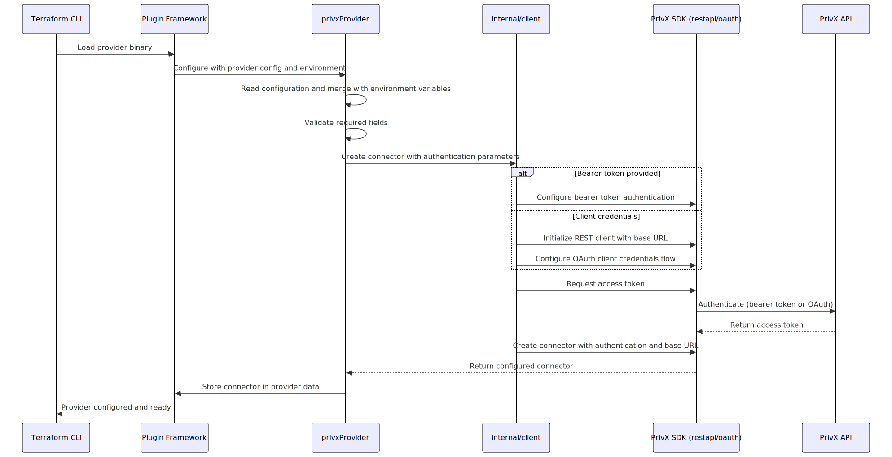

# High Level Design

This repository implements the `privx` Terraform provider using the Terraform Plugin Framework v1.x and the PrivX Go SDK v2. The code is organised into:

- `main.go`: binary entrypoint, injects HashiCorp’s `providerserver` into `internal/provider`.
- `internal/provider`: Terraform provider, resources and data sources (main extension surface for PrivX integration).
- `internal/client`: adapter that configures the PrivX Go SDK (`privx-sdk-go`) and exposes a `restapi.Connector`.
- `internal/utils`: shared helpers (currently JSON comparison).

## Other documents

- [Requirements](REQUIREMENTS.md): toolchain, versions and development environment.
- [Development](DEVELOPMENT.md): build, dependency management, demo project and documentation generation.

## High‑level architecture

1. **Terraform CLI** loads the `terraform-provider-privx` binary and calls into the Plugin Framework.

1. The **provider implementation** (`internal/provider`) exposes:
   - Provider configuration schema and validation.
   - Factories for resources and data sources.

1. During provider initialization (before `plan` or `apply`), the provider's `Configure` method builds a **PrivX REST connector** using `internal/client`.

1. Each resource/data source receives the connector via `Configure` and instantiates the relevant **PrivX API client** (e.g. `authorizer.Authorizer`).

1. CRUD / Read operations map Terraform schema models to/from PrivX SDK models and HTTP APIs.

The following diagram shows the main components:

## PrivX authentication

Authentication is handled centrally in `internal/client` and configured via the provider block and/or environment variables.

The sequence below shows how configuration is resolved and a PrivX connector is created:

### Configuration
The provider accepts credentials via Terraform configuration or environment variables:

| Setting                   | Environment Variable            | Description               |
|---------------------------|---------------------------------|---------------------------|
| `api_base_url`            | `PRIVX_API_BASE_URL`            | PrivX server URL          |
| `api_bearer_token`        | `PRIVX_API_BEARER_TOKEN`        | Pre-obtained bearer token |
| `api_client_id`           | `PRIVX_API_CLIENT_ID`           | API client ID             |
| `api_client_secret`       | `PRIVX_API_CLIENT_SECRET`       | API client secret         |
| `api_oauth_client_id`     | `PRIVX_API_OAUTH_CLIENT_ID`     | OAuth client ID           |
| `api_oauth_client_secret` | `PRIVX_API_OAUTH_CLIENT_SECRET` | OAuth client secret       |

Terraform configuration takes precedence over environment variables.

### Authentication Methods
The provider supports two authentication methods:

1. **Bearer Token** (simplest): If `api_bearer_token` is provided, the provider uses it directly for all API calls.

2. **OAuth Client Credentials**: If no bearer token is set, the provider uses the API client and OAuth ID/secret pairs to obtain an access token from PrivX. Authentication happens once during provider initialization. The resulting API connection is then shared by all resources and data sources.

## Terraform and PrivX SDK integration

The diagram below shows how the provider connects Terraform to the PrivX API:

### How the Pieces Fit Together

**Provider** (`privxProvider`)
The provider is the entry point. It:
- Defines configuration options (API URL, credentials, etc.)
- Creates and shares a single PrivX API connection
- Registers all available resources and data sources

**Resources and Data Sources**
Each resource (e.g., `privx_access_group`) and data source follows the same pattern:
1. Receives the shared API connection from the provider
2. Creates a specialized API client for its domain (e.g., `authorizer.Authorizer` for access groups)
3. Translates between Terraform state and PrivX API calls

## Provider Flow

**Provider Setup (happens once)**
1. Terraform loads the provider
2. Provider reads configuration (from `.tf` files or environment variables)
3. Provider authenticates with PrivX and creates an API connection
4. This connection is shared with all resources and data sources

**Resource Operations (during `terraform apply`)**
- **Create**: Read planned values → call PrivX API to create → store returned ID in state
- **Read**: Fetch current state from PrivX API → update Terraform state
- **Update**: Read planned values → call PrivX API to update → refresh state
- **Delete**: Call PrivX API to delete → remove from Terraform state

**Data Source Operations**
When Terraform needs to look up existing PrivX objects:
1. Read filter criteria from configuration (e.g., `name = "admins"`)
2. Query the PrivX API
3. Return matching object's attributes to Terraform

## Adding New Resources

To add support for a new PrivX object type:
1. Create a resource file in `internal/provider/` (e.g., `my_resource.go`)
2. Define the Terraform schema (what attributes users can set)
3. Implement the CRUD operations using the appropriate PrivX SDK client
4. Register the resource in `provider.go`
